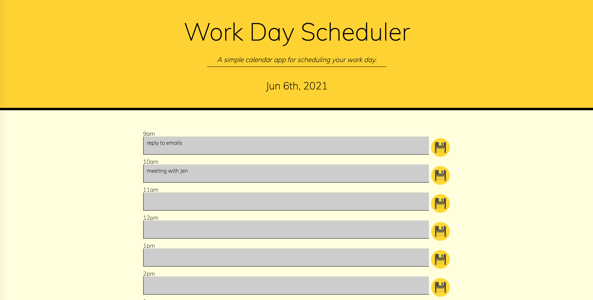

# Day Planner
This is a simple day planner that allows the user to schedule and plan their work day, between the hours of 9am to 5pm. It saves the user's tasks for the day and empties the storage the next day.

The time of day is apparent through the colour of the time blocks. Gray time blocks indicates past time. The red block inidicates the current time, and green blocks indicate future time.

This planner was made using:
- HTML
- CSS
- Moment.js 
- jQuery
- Canva

# Deployed URL
https://anamolly.github.io/Day_Planner/

# Screenshot

