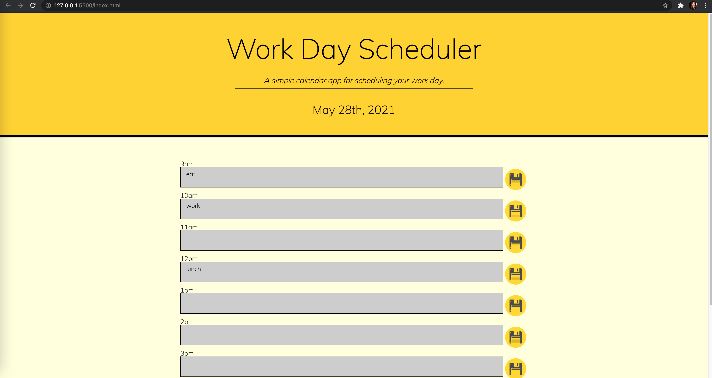

# Day Planner
This day planner was made using HTML, CSS, Moment.js and JQuery.

# HTML File
- the HTML file contains a jumbotron with the current date as well as time blocks that represent a standard work schedule (9am-5pm).
- within in time block, there is a label that holds the time, a textarea that holds the day's tasks and an input tag that holds the save button.

# CSS File
- the CSS file contains styling for the day planner. It does not include the colour styling for the input fields.

# JS File
- the JS file contains moment.js and jquery.
- current time is determined using moment.js.
- within the file, there is a function that changes the background colour of the input fields depending on the time of day. Past time is represented by gray fields. Current time is represented by pink fields and future time is represented by green fields. If statements were used to check the time of day and change the field colours.
- there is a rendertasks function which retrieves the taskblockid and userinputs from local storage, and sets the value of the textarea to the userinputs.
- there is also a save button and a 'click' event listener. within this event listener, there is a function that sets the taskblockids and userinputs to local storage.
- the last function is the clearplanner function, which clears local storage at 12:00am, so that new tasks can be added to local storage the following day.

# Screenshot

# Deployed URL
https://anamolly.github.io/Day_Planner/